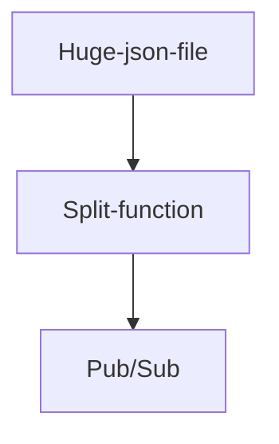

## Workflow diagram:


## Deploy from local machine:
```bash
gcloud functions deploy bucket-file-reader --gen2 --runtime=go119 --memory=16Gi --region=us-central1 --source=. --entry-point=ListenForFile --trigger-event-filters="type=google.cloud.storage.object.v1.finalized" --trigger-event-filters="bucket=pc-file" --update-env-vars=BUCKET="pc-file" 
```
